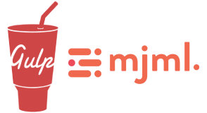

MJML + Gulp EDM builder
=======================================

HTML email development today (2024) is _still_ an unwelcome nod to the days of inconsistent browser rendering and CSS hacks. MJML (mailjet markup language) attempts to solve this by abstracting away the brutal HTML patterns that are required for correct rendering across the multitude of commonly used email clients.

An understanding of the available [MJML components](https://documentation.mjml.io/#standard-body-components) and their options is essential for using this repo.

### Download & Installation

```shell 
$ npm i
$ npm i -g gulp-cli
```

### Creating a new EDM

First update gulpfile.js line 1 to the required working path.
```js
// gulpfile.js
const edmPath = 'src/client/job-abc123/edm1'
```
```shell
$ gulp
```
If the edmPath does not exist `./src/new-template` will be cloned and you are off and running.

### Gulp task breakdown

`$ gulp` compiles mjml displaying result and watches for changes. 

`$ gulp dist` will build the project and zip to `./dist` for production and testing. The built html and images are also copied into the directory. Creates 600w and 375w screenshots @ `${edmPath}` for use with `$ gulp archive`  

`$ gulp archive` creates and serves a page showing all current edm builds. Useful for identifying mjml blocks to copy for new edm builds.

### Tips / Gotchas
- Creating a Mailchimp/Campaign Monitor template? Use [`<mj-raw>`](https://documentation.mjml.io/#mj-raw), [`<!-- htmlmin:ignore -->`](https://documentation.mjml.io/#mj-raw)
- [Make whole MJML button padding clickable](https://stackoverflow.com/questions/61601793/mjml-clickable-button-not-just-the-text-inside-the-button)  

  ```html
  <mj-style>
  .my-btn a {
    display: block;
  }
  </mj-style>
  <mj-button class="my-btn" />
  ```

### TODOS

* email on acid test upload via API. Requires api key for auth.